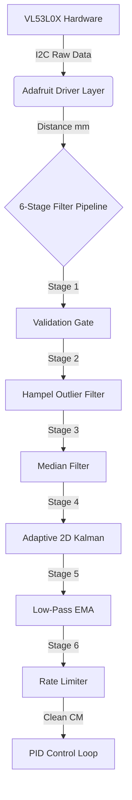

# Ball And Beam Project in 2026

Dự án điều khiển tự động hệ thống Ball and Beam sử dụng cảm biến khoảng cách VL53L0X và vi điều khiển ESP32-S3.

## Cấu trúc thư mục
- `main/`: Chứa mã nguồn chính.
- `test/`: Chứa các bản test cho từng module.
  - `VL53L0X.ino`: File thuật toán lọc nhiễu cho cảm biến.

## Kiến Trúc Luồng Dữ Liệu

Dự án tuân thủ kiến trúc phân tầng để đảm bảo tính ổn định cho hệ thống:

### Chi tiết các tầng xử lý:
1. **Hardware Layer (I2C):** Giao tiếp với cảm biến.
2. **Driver Layer:** huyển đổi bit nhị phân thành số đo milimet thô.
3. **Processing Layer (Bối cảnh chính):**
   - **Lọc nhiễu gai (Hampel/Median):** Loại bỏ các giá trị nhảy vọt do tia laser bị tán xạ.
   - **Ước lượng trạng thái (Kalman):** Tính toán vị trí giảm trễ tín hiệu.
   - **Ép phẳng tín hiệu (EMA/Rate Limit):** Đảm bảo dữ liệu tuân thủ các giới hạn vật lý của quả bóng thực tế.

---

*(13/03/2026)*
